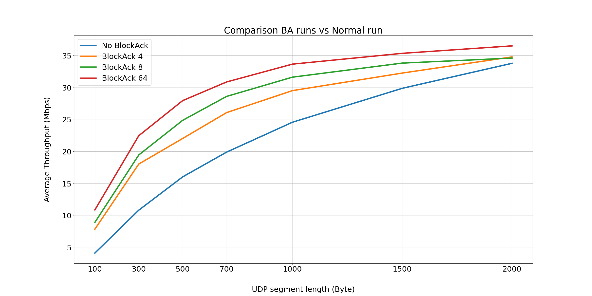

# Wi-Fi Throughput with Block ACKs

This repository contains code and simulation configurations for analyzing Wi-Fi throughput using Block Acknowledgment (Block ACK) a technique introduced in the 802.11e standard and later standardized in 802.11n, allowing multiple frame acknowledgments to be grouped together to improve communication efficiency.

The goal is to simulate different network scenarios and compare the throughput with and without the use of Block ACK to study its effectivness.

  
## Requirements

- [Omnet++](https://omnetpp.org/) for simulation
- INET Framework for simulating network protocols
- Python (for data analysis and visualization)


## Setup 

1. Install Omnet++ and the INET Framework.
2. Clone the repository:
   ```bash
   git clone https://github.com/Zanotto-Enrico/OmnetppBlockAck/
   cd OmnetppBlockAck
   ```
3. To run the simulations, follow these steps:
   - Launch Omnet++.
   - Load the INET Framework.
   - Open one of the `.ini` configuration files from the `simulation` directory.
   - Run the simulation with the Omnet++ IDE or in the terminal wiht `opp_run`.
4. Results will be saved as `.vec .vci .sca` files in the `results/` directory, .

## Simulation Configurations

### NormalRun

This configuration simulates standard UDP communication without Block ACK.

```ini
[Config NormalRun]
description = "1500B packets, no fragmentation, no BlockAck"
*.sourceHost.app[*].messageLength = 1500byte
*.sourceHost.app[*].sendInterval = ${packetLength} * 8 / ${bitrate} * 1us
*.*Host.wlan[*].mac.hcf.isBlockAckSupported = false
```

### BlockAck

This configuration simulates communication with Block ACK enabled and a frame threshold of 16.

```ini
[Config BlockAck]
description = "1500B packets, no fragmentation, BlockAck with threshold of 16"
*.sourceHost.app[*].messageLength = 1500byte
*.sourceHost.app[*].sendInterval = ${packetLength} * 8 / ${bitrate} * 1us
*.*Host.wlan[*].mac.hcf.isBlockAckSupported = true
*.*Host.wlan[*].mac.hcf.originatorAckPolicy.blockAckReqThreshold = 16
```

### BlockAckThresholds

This configuration allows to compare the effective gains in performance of sessions with Block ACK to sessions without it using different frame thresholds

```ini
[Config blockAckThresholds]
description = "comparing different frames thresholds before sending the BA"
*.*Host.wlan[*].mac.hcf.originatorAckPolicy.blockAckReqThreshold = 4, 8, 12, 16, 20, 24, 32, 64
```

### BlockAckFragmentations

This configuration allows to compare the effective gains in performance of sessions with Block ACK to sessions without it using different frame length

```ini
[Config blockAckFragmentations]
description = "comparing BlockAck vs NoBlockAck with different frames length"
*.sourceHost.app[*].messageLength = ${packetLength = 100,300,500,700,1000,1500,2000}byte
*.sourceHost.app[*].sendInterval = ${packetLength} * 8 / ${bitrate} * 1us
*.*Host.wlan[*].mac.hcf.isBlockAckSupported = ${isBlockAckSupported=true,false}
*.*Host.wlan[*].mac.hcf.originatorAckPolicy.blockAckReqThreshold = 64
```
## Results and Analysis

After running the simulations, the data has been analyzed using the provided Python scripts. The analysis calculated throughput with different payload sizes and Block ACK thresholds.
The graphs generated will be saved in the `images/` directory.

- **Throughput Comparison (No Block ACK vs Block ACK)**:
  - Displays the difference in throughput when using Block ACK versus the traditional acknowledgment method with different frame number thresholds.
   

- **Throughput Gain with Fragmentation**:
  - A series of bar graphs divided by the frame length showing the average Throughput when Block ACK is used based on the frame number threshold set in the communication.
  The black line represents the theoretical calculated value
   


- **Throughput Gain with Block ACK**:
  - A bar graph showing the percentage gain in throughput when Block ACK is used based on the average size of the frame sent.
<p align="center">
  
</p>

